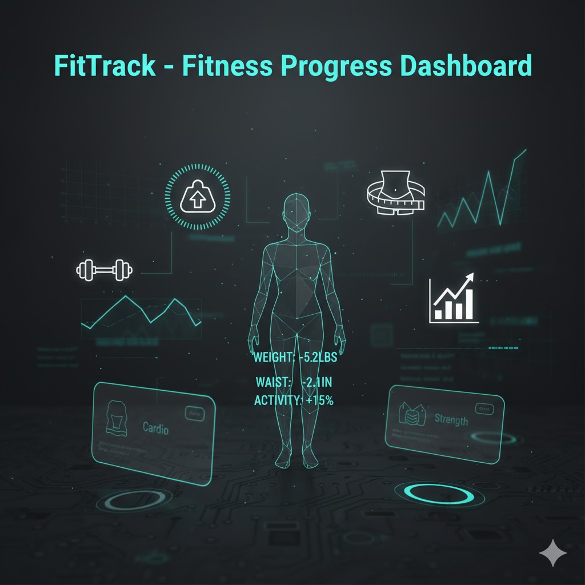
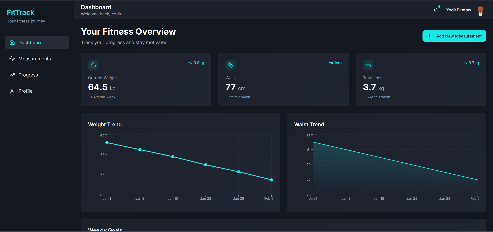
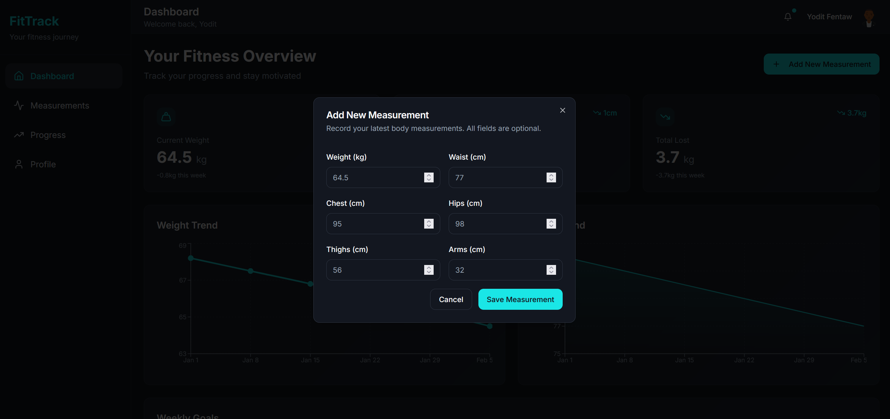
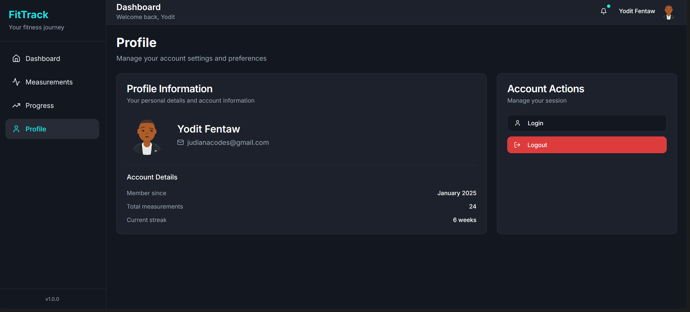

# FitTrack 🚀 (Work in Progress)

FitTrack is a personal fitness tracking web app built as a **learning-by-building project**.  
The goal is to understand how modern full-stack applications work by implementing features step by step and documenting the process along the way.

⚠️ **This project is intentionally developed in public.**  
It is not a finished product — it is a transparent learning journey.

---

## 🎯 Project Motivation

Many fitness apps focus on polished user interfaces but hide the technical complexity behind them.  
FitTrack exists to explore and understand:

- How frontend and backend communicate
- How fitness data can be modeled and stored
- How APIs, authentication, and dashboards work together
- How to design a project with scalability in mind

This repository prioritizes **clarity and learning** over completeness.

---

## 🧱 What I’m Building

FitTrack allows users to:

- Log fitness-related data (e.g. workouts, metrics)
- View progress over time
- Understand how their data flows through a full-stack system

The scope will grow incrementally as new concepts are learned.

---

## 🛠 Tech Stack

**Frontend**

- React
- TypeScript
- (Add styling library if applicable)

**Backend**

- FastAPI (Python)

> Backend concepts and implementation decisions are based on a structured FastAPI learning roadmap, documented separately here:  
> 🔗 https://github.com/zhudiana/FastAPI-Learning-Roadmap

**Database**

- PostgreSQL

**Other Tools**

- Git & GitHub
- REST APIs
- Environment variables & config management

---

## 📂 Project Structure

```text
FitTrack/
├── backend/        # FastAPI backend
├── frontend/       # TypeScript frontend
├── docs/           # Learning notes & tutorials
└── README.md

---

## 🖼 Screenshots

<p align="center">
	
</p>

Gallery:

<p align="center">
	
	
	
</p>
```
